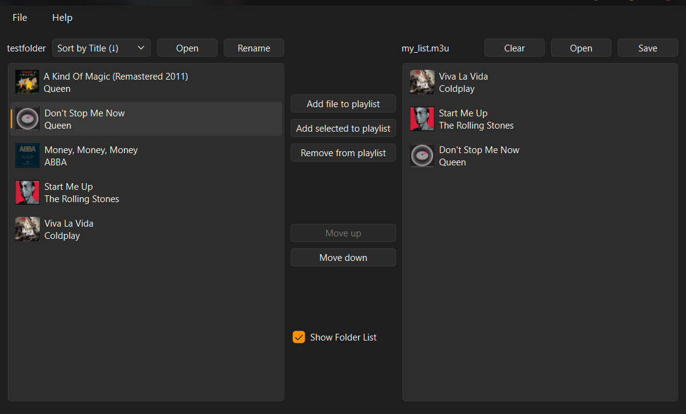
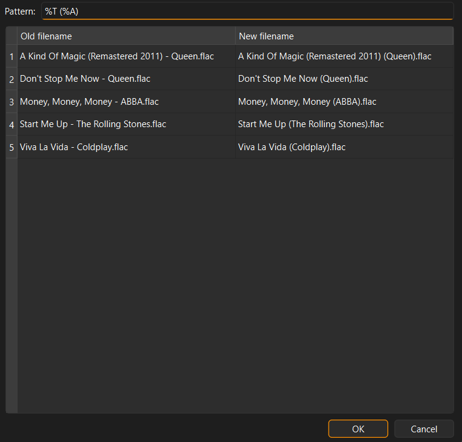

[](https://www.gnu.org/licenses/agpl-3.0)

# M3U Playlist Editor

A lightweight graphical tool for managing, sorting, and batch-renaming `.m3u` playlists.

- [Features](#features)
- [Limitations](#limitations)
- [Quick Start](#quick-start)  
- [Batch Renaming](#batch-renaming)
- [Absolute and Relative Paths](#absolute-and-relative-paths)
- [Run from source](#run-from-source)

| Main Editor View | Batch Rename Dialog |
| :---: | :---: |
|  |  |

## Features
- **Folder View:** Display all audio tracks in a selected directory.
- **Batch Renaming:** Rename files based on embedded metadata tags (see [Batch Renaming](#batch-renaming)).
- **Playlist Management:** Rearrange tracks via drag-and-drop and add songs manually.
- **Sorting:** Sort folder contents by title or artist (ascending and descending).
- **Compact Mode:** Hide the folder panel if you don't need it.
- **Path Flexibility:** Support for absolute and relative paths (see [Absolute and Relative Paths](#absolute-and-relative-paths)).

## Limitations
- Currently, only .flac files are supported (.mp3 support might come in the future)
- Only plain-text .m3u playlists are supported

## Quick Start
- **Windows**: Download the latest `.exe` from the [releases](https://github.com/leonhardw/m3u-editor/releases), unzip and run `M3U-Editor.exe`.
     ## ⚠️ Note on Security Warnings (False Positives)
     When downloading the Windows release, you might receive a warning from Windows Defender or SmartScreen (e.g., "Windows protected your PC" or "Unknown Publisher").  
     **To launch the program, click on "More info" and then select "Run anyway".**
  <details>
     <summary>
        <b>Why is this happening and why should I trust you? (Click to expand)</b>
     </summary>
        <br>
     This is a false positive. Most antivirus programs flag new, unsigned executables as suspicious by default. Since this project is open-source and not digitally signed with a costly Microsoft certificate, Windows treats it with caution.

     #### How to proceed:
     - **VirusTotal Status:** Upload the ZIP archive to [VirusTotal](https://www.virustotal.com) to have the file checked by 50+ scanners.
       You might see specific alerts like `Static AI - Suspicious Archive` (SentinelOne) or `Riskware.PyInstaller` (Yandex).  
       **Why?** These are triggered because the app is bundled using **PyInstaller**.  
       **Status:** Major engines (Microsoft, Google, Avast, etc.) confirm the file is safe.  
     - Verify the source: You can always inspect the source code here on GitHub.
     - **Automated builds:** The executables are <ins>**always**</ins> generated by [GitHub Actions](https://github.com/leonhardw/m3u-editor/actions) which means they are compiled directly from the unmodified source code in this repository.
     - Check the hash: (Optional) Compare the SHA-256 hash of your download with the one listed directly next to the ZIP archive in the Releases section to ensure the file hasn't been tampered with.
     ---
    </details>
   
- **Linux and macOS**: Binaries coming soon. For now, you have to run from source.
- **From source**: See [Run From Source](#run-from-source) below.

## Batch Renaming
> [!WARNING]
> Renaming will break all paths in playlists. Always create playlists **after** batch renaming.

1. Check "Show folder list" and open a folder containing .flac files.
2. Click on "Rename"
3. Enter the new filename pattern with the following placeholders:  
  - `%T` = Title  
  - `%A` = Artist  

*Example:* `%T (%A)` → `Title (Artist).flac`

**Note:**
- Metadata is extracted directly from embedded FLAC tags (the original filename is not analyzed).
- Do **not** include `.flac` in your custom pattern.
- You do not need to use every placeholder.
- Duplicate filenames automatically receive incremental suffixes like `(1)`, `(2)`, etc.
- Tracks without metadata will be skipped.

## Absolute and Relative Paths
When saving a playlist, choose between two path formats:

- **Relative Paths:** File paths are relative to the directory where the `.m3u` file is saved. Moving the playlist file independently will break track paths, but if the playlist is moved alongside the tracks, the paths will still work. To relocate a playlist with relative paths, open it in the editor and save it to the new location. 
- **Absolute Paths:** Stores explicit full system paths, keeping the playlist functional regardless of where the `.m3u` file itself is moved but moving the playlist alongside the tracks will not work.

## Run From Source
Requirements: Python 3.10 or newer
1. Clone or download this repository:
```bash
git clone https://github.com/leonhardw/m3u-editor.git
cd m3u-editor
```
2. Install dependencies
```bash
# Windows
pip install -r requirements.txt

# Linux and macOS
pip3 install -r requirements.txt
```
3. Run
```bash
# Windows
python playlisteditor.py

# Linux and macOS
python3 playlisteditor.py
```


